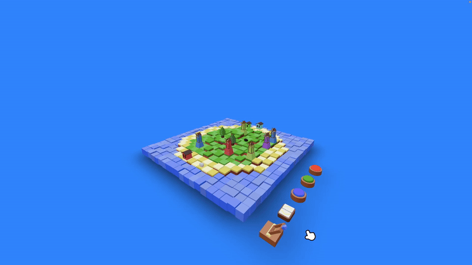

# salut 👋
<a href="https://bsky.app/profile/romubuntu.bsky.social"> <code></code></a>
<a href="https://www.youtube.com/@romubuntu"><code></code></a>
<a href="https://www.twitch.tv/romubuntu"><code></code></a>
<a href="https://www.instagram.com/romubuntu/"><code></code></a>

☁️ je suis **dévelopeur créatif** sur du web et jv  
📹 en live **tous les jours** sur Twitch  
📺 prochaine vidéo youtube : **14 juin 2025**  
📬 tu peux me contacter ici : **salut@romubuntu.dev**  

### mes technos favs
j'adore créer des expériences **interractives et innovantes** sur le web avec :  
<code></code>
<code></code>
<code></code>
<code></code>
<code></code>     

je suis aussi super curieux de la création de jeux vidéos **complexes et créatifs** avec :  
<code></code>
<code></code> <code></code>  

### mon dernier projet : 🎶 Music Island 🏝️

Personnalise ton 🏝️ île avec des 🏠 maisons, 🌲 arbres et 🎡 moulins et compose par la même occasion de la 🎵 musique !

*Le site a été crée pour un challenge Three.Js Journey de @brunosimon.*

